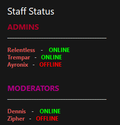

# **Sinus Template**

> A [SinusBot][sinus] script that will automatically ...

[][resource-page]
[][resource-page]

- [Discord][discord]
- [Sinusbot Resource Page][resource-page]

---

If you want to request a script for personal use or if you just have a good idea for another public script, join our [Discord][discord] and talk to one of the *RLNT* members.

---

 

<!-- Table of Contents -->

    

        <strong>Table of Contents (click to expand)</strong>
    

- [**Sinus Template**](#sinus-template)
  - [**📑 Overview**](#-overview)
  - [**🔧 Installation**](#-installation)
  - [**📕 History**](#-history)
  - [**⏰ Changelog**](#-changelog)
  - [**🎓 License**](#-license)

## **📑 Overview**
This is a script for the [SinusBot][sinus]. It will automatically ...

It can be used to ...

    

        <strong>Preview (click to expand)</strong>
    

## **🔧 Installation**

1. Download the latest **js-file** from the [releases].
2. Drop it in the scripts folder of your [SinusBot][sinus].
3. Start/Restart the bot.
4. Navigate to the script settings.
5. Configure it to your liking (we recommend using [this guide][config-guide]), activate and save it and then restart the bot instance.

## **📕 History**
This script was requested by [Anyone][requester].

## **⏰ Changelog**
Everything related to versions and their release notes can be found in the [changelog].

## **🎓 License**
This project is licensed under the [GNU GPL v3.0][license].

<!-- Links -->
[sinus]: https://www.sinusbot.com/
[discord]: https://discordapp.com/invite/Q3qxws6
[resource-page]: https://forum.sinusbot.com/resources/todo
[releases]: https://github.com/RLNT/sinus-template/releases
[config-guide]: CONFIGURATION.md
[requester]: https://forum.sinusbot.com/members/anyone/
[changelog]: CHANGELOG.md
[license]: LICENSE.md
